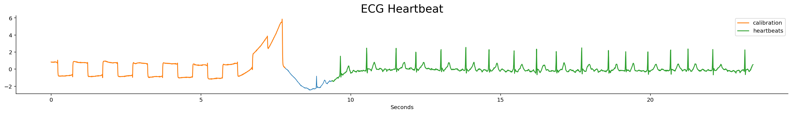
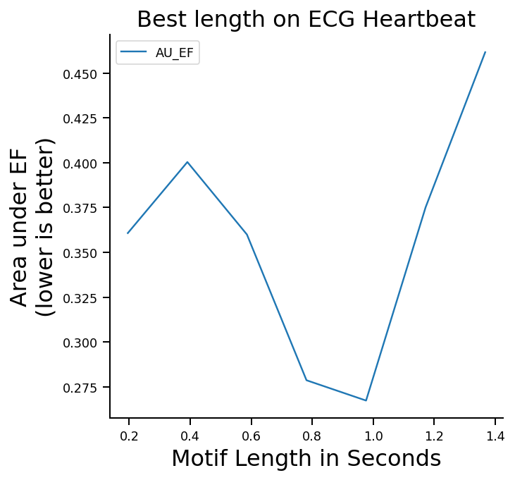
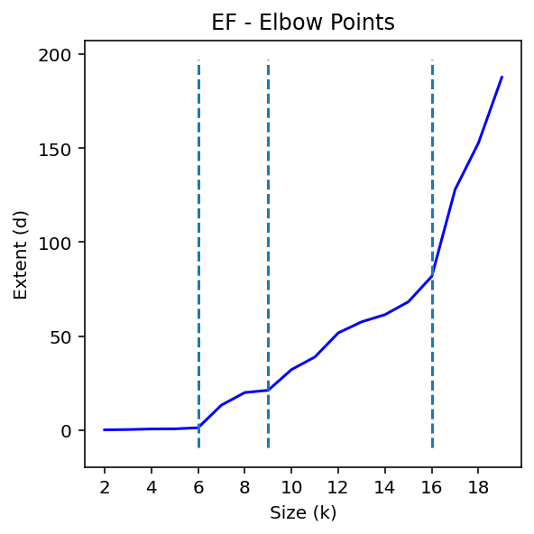
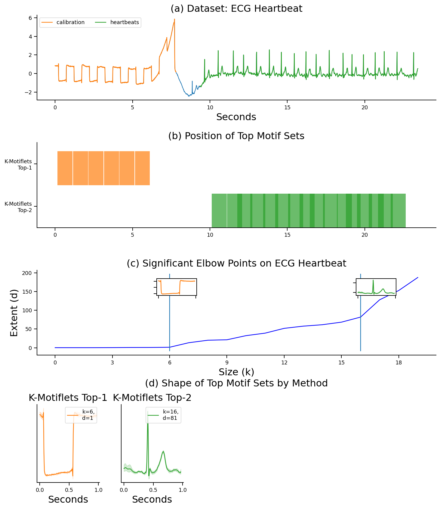

# Motiflets

This page was built in support of our paper "Motiflets - Fast and Accurate Detection of Motifs in Time Series" by Patrick Schäfer and Ulf Leser.

The paper is completely self-contained, the purpose of this webpage is to provide the 
k-Motiflet code, and the raw data to readers of the paper.

Supporting Material
- `notebooks`: Please see the Jupyter Notebooks for use cases
- `csvs`: The results of the scalability experiments
- `motiflets`: Code implementing k-Motiflet
- `datasets`: Use cases in the paper

# Motiflets

This TS is an ECG from the Long Term Atrial Fibrillation (LTAF) database, which 
is often used for demonstrations in motif discovery (MD). The problem is particularly 
difficult for MD as actually two motifs exists: The first half of the TS contains a 
rectangular calibration signal with 6 occurrences, and the second half shows ECG 
heartbeats with 16 to 17 occurrences. 



# Learning the motif length `l`

We first extract meaningful motif lengths from this use case:

```
ks = 20
length_range = np.arange(25,200,25) 
motif_length = plot_motif_length_selection(
    ks, series, file, 
    motif_length_range=length_range, ds_name=ds_name)
```


The plot shows that meaningful motifs are within a range og 0.8 to 1 second, equal
to roughly a heartbeat rate of 60-80 bpm.

# Learning motif size `k`

To extract meaningful motif sizes from this use case, we run

```
dists, motiflets, elbow_points = plot_elbow(
    20, series, file, ds_name=ds_name, plot_elbows=True,
    motif_length=motif_length, method_name="K-Motiflets", ground_truth=df_gt)
```

Elbow points illustrate meaningful motif sizes. Here, 6, 9 and 16 are elbows. 
While k=9 also shows an elbow, our method filters it, as it is very similar to k=16.



We finally plot these motifs:



The variable `elbow_points` holds the characteristic motif sizes.
