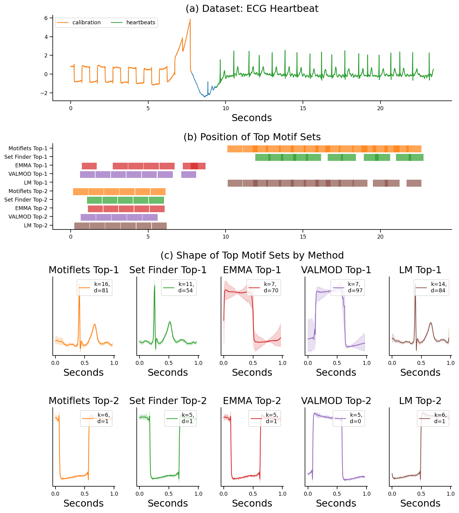

# Motiflets

This page was built in support of our paper "Motiflets - Simple and Accurate Detection of Motifs in Time Series" by Patrick Schäfer and Ulf Leser.

The paper is completely self-contained, the purpose of this webpage is to provide the 
k-Motiflet code, and the raw data to readers of the paper.

Supporting Material
- `notebooks`: Please see the Jupyter Notebooks for use cases
- `csvs`: The results of the scalability experiments
- `motiflets`: Code implementing k-Motiflet
- `datasets`: Use cases in the paper
- `jars`: Java code of the competitors used in out paper: EMMA, Latent Motifs and Set Finder.

# k-Motiflets

Intuitively speaking, k-Motiflets are the largest set of exactly k similar subsequences.

# Showcase

The following video highlights the ease of use of $k$-Motiflets using an ECG recording from the Long Term Atrial Fibrillation (LTAF) database.

**In essence, there is no need for tuning any real-valued similarity threshold via trial-and-error, as is teh case for virtually all motif set competitors. 
Instead, for $k$-Motiflets we may either directly set the maximal number of repetitions $k$ of a motif, or simply learn this value from the data.**

https://user-images.githubusercontent.com/7783034/173186103-c8b6302e-2434-4a09-89f4-ddad2e63f997.mp4

# Usage

Here we illustrate how to use k-Motiflets. 

The following TS is an ECG from the Long Term Atrial Fibrillation (LTAF) database, which 
is often used for demonstrations in motif discovery (MD). The problem is particularly 
difficult for MD as actually two motifs exists: The first half of the TS contains a 
rectangular calibration signal with 6 occurrences, and the second half shows ECG 
heartbeats with 16 to 17 occurrences. 


The major challenges in motif discovery are to learn the length of interesting motifs
and to find the largest set of the same motif, i.e. all repetitions.

# Learning the motif length `l`

We first extract meaningful **motif lengths (l)** from this use case:

```
ks = 20
length_range = np.arange(25,200,25) 
motif_length = plot_motif_length_selection(
    ks, series, file, 
    motif_length_range=length_range, ds_name=ds_name)
```


The plot shows that meaningful motifs are within a range of 0.8s to 1s, equal
to roughly a heartbeat rate of 60-80 bpm.

# Learning the motif size `k`

To extract meaningful **motif sizes (k)** from this use case, we run 

```
dists, motiflets, elbow_points = plot_elbow(
    ks, series, file, ds_name=ds_name, plot_elbows=True,
    motif_length=motif_length, method_name="K-Motiflets", ground_truth=df_gt)
```

The variable `elbow_points` holds characteristic motif sizes found.  
Elbow points represent meaningful motif sizes. Here, $6$ and $16$ are elbows, which are 
the 6 calibration waves and the 16 heartbeats.


We finally plot these motifs:


The first repetitions perfectly match the calibration signal (orange), while the latter 16 
repetitions perfectly match the ECG waves (green).


# Competitor Methods

We then pretended to have an oracle, used the optimal values $r=d/2$ and $l=125$ to find motif sets using the competitor methods. Here are the results for EMMA, VALMOD, Set Motifs, and Learning Motifs:



None of the competitors is able to find all occurrences, **even using an oracle on the optimal values**. Thus, failure to provide the exact similarity threshold needed by each method, results in a missed, too small or blurred motif set.

**We may improve the results with an extensive trial-and-error tuning of the real-valued threshold, though. Yet, $k$-Motiflets discovered all occurences of the two top motifs without any additional tuning by simply setting $k=6$ or $k=16$, and we can even learn these two values using the elbow-plot presented above.**


